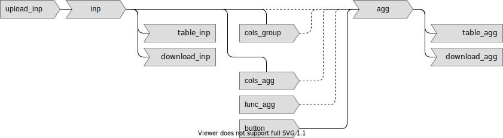

# Preface {.unnumbered}

The purpose of this book is to show how to implement reactive data-science apps using three languages/frameworks:

-   R: Shiny
-   Python: Dash
-   JavaScript: Observable

```{r}

```
